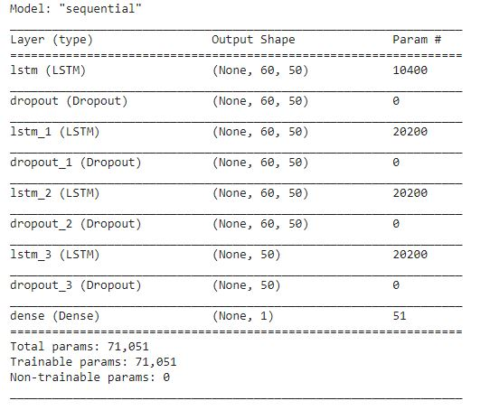

# Google Stock Prcie Prediction using RNN

## Business Problem
#### The given dataset contained information about the Google stock price for 5years (2012-2017). The goal was to use this information and design a model that could predict accurately the prices for the shares in January 2017.

## Model
#### Recurrent Neural Networks (RNN) was used to solve this problem. After the initial data exploration part, the dataset was normalized. This was followed by creating a structure that had 60 time-lapses and gave a single output. This step was done so that the model took the data for the past 60 days to predict for the 61st day.
#### This was followed by building the architecture of the RNN. A summary of the architecture can be found below.

#### After this, the model was fit to the training set and this was followed by importing and getting the training set into the picture.
#### The model was then used to make predictions, and a visual to compare the actual and predicted values was plotted.

## Accuracy
#### There was a difference of $14.5 between the actual and the predicted values. The predicted values lagged by $14.5.
